# 贺宣锦 · Xuanjin.He — UI/UX 作品集

个人作品集网站。UI/UX 设计师，专注 **用户需求 · 产品逻辑 · AI × UX**，擅长把复杂信息转化为清晰、易用的数字产品体验。

## 🚀 在线预览

**👉 [点击在线预览 → hexuanjinhe.netlify.app](https://hexuanjinhe.netlify.app/)**

## 📸 作品截图

| | |
|---|---|
| 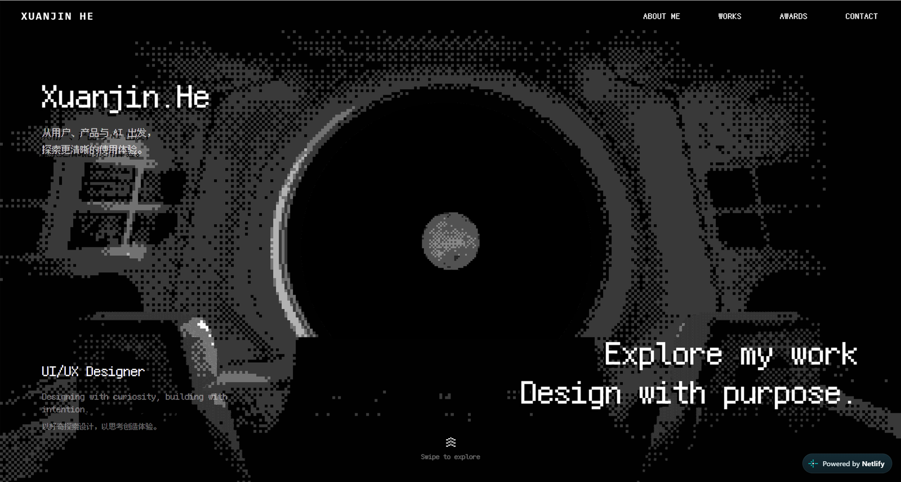 | 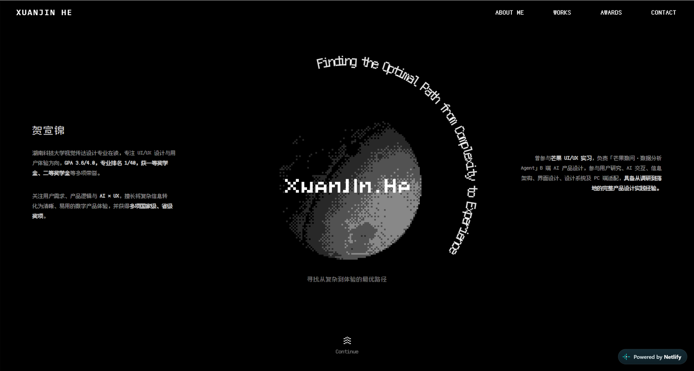 |
| 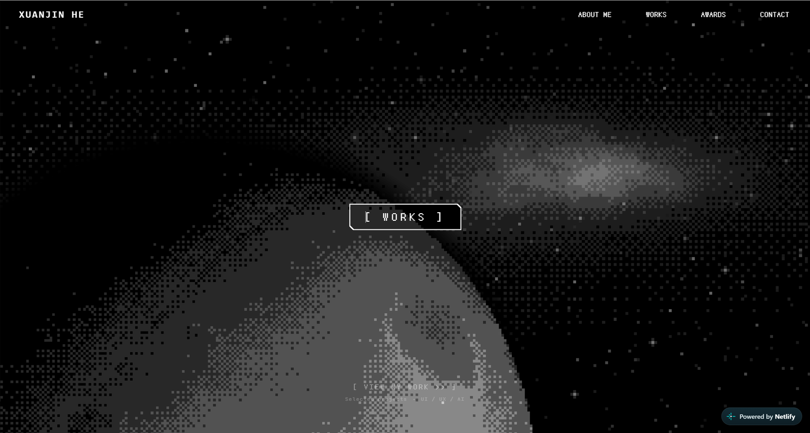 | 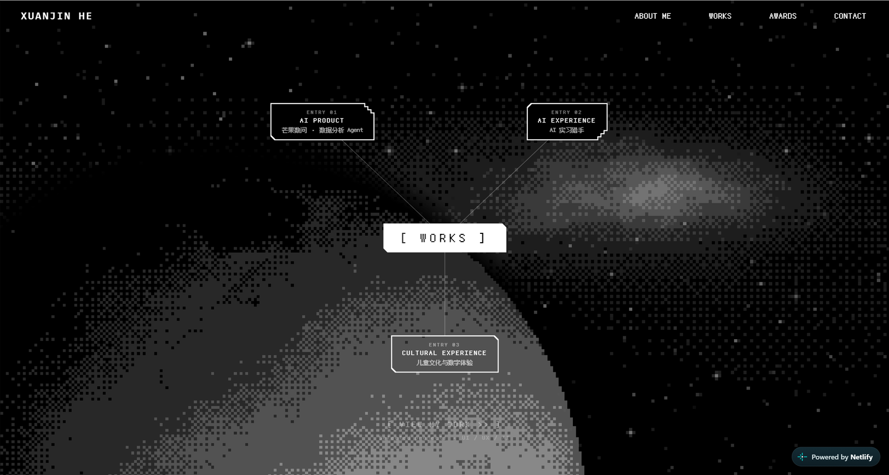 |
| 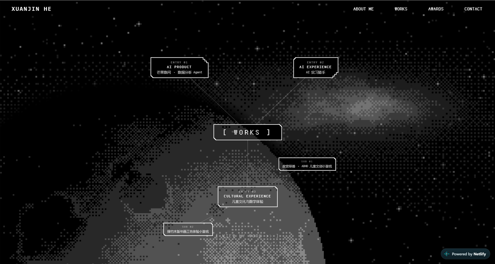 | 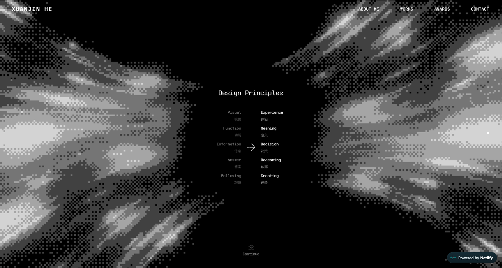 |
| 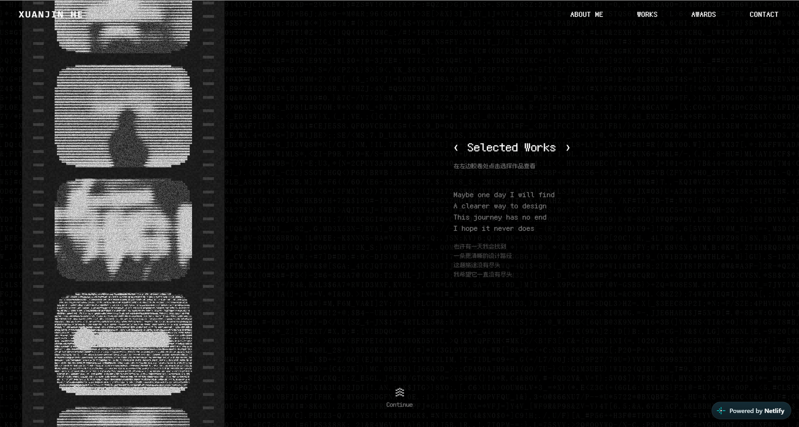 | 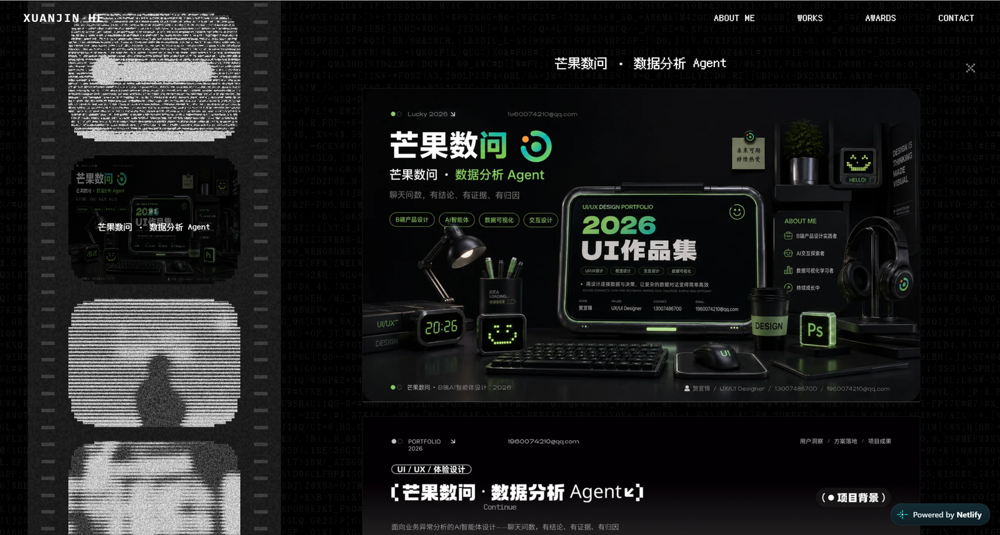 |
| 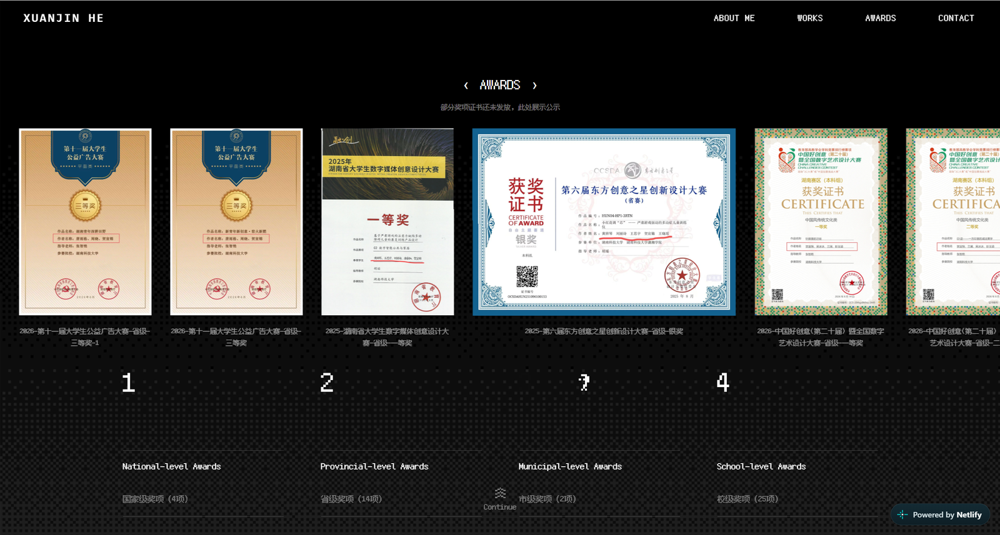 | 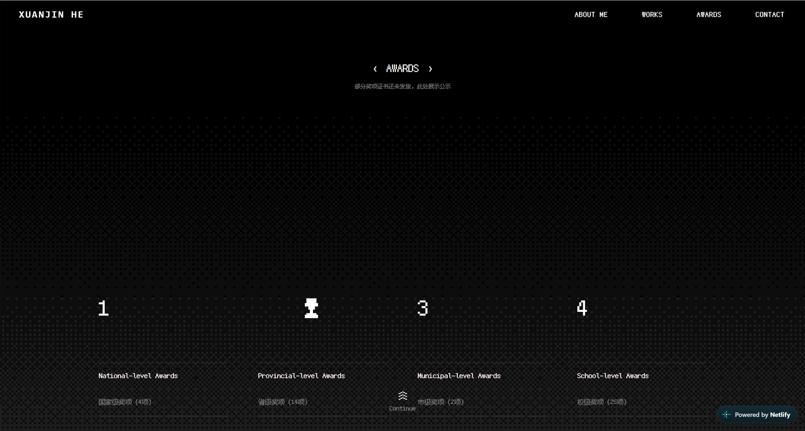 |
| 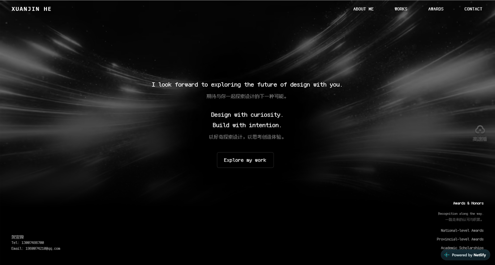 | |

## 关于我

- 湖南科技大学 视觉传达设计专业 在读，专注 UI/UX 设计与用户体验方向，GPA 3.6/4.0，专业排名 1/40
- 获一等奖学金、二等奖学金等多项荣誉
- 曾参与芒果 UI/UX 实习，负责「芒果数问 · 数据分析 Agent」B 端 AI 产品设计，参与用户研究、AI 交互、信息架构、界面设计、设计系统及 PC 端适配，具备从调研到落地的完整产品设计实践经验

## 作品

| # | 项目 | 方向 |
|---|------|------|
| 01 | 芒果数问 · 数据分析 Agent | AI 产品 · B 端 |
| 02 | AI 实习猎手 | AI 驱动的求职决策体验 |
| 03 | 故宫脊兽 · ADHD 儿童文创小游戏 | 儿童 · 文化 · 数字体验 |
| 04 | 绵竹木版年画工坊体验小游戏 | 儿童 · 文化 · 数字体验 |

## 奖项

- **国家级 4 项**：中国大学生广告艺术节学院奖、中国好创意（第二十届）暨全国数字艺术设计大赛等
- **省级 14 项**：湖南省大学生数字媒体创意设计大赛、东方创意之星创新设计大赛、湖南省大学生广告艺术大赛等
- **市级 2 项 · 校级 25 项**

## 技术栈

Next.js 16 · React 19 · TypeScript · Tailwind CSS v4

## 运行

```bash
npm install
npm run dev      # 本地开发
npm run build    # 生产构建
npm run check    # lint + typecheck + build
```

## 许可

本项目代码基于 MIT 许可的 [AI Website Cloner Template](https://github.com/JCodesMore/ai-website-cloner-template)（© 2025 JCodesMore）搭建，作品内容、文案与设计为本人完成。详见 [LICENSE](./LICENSE)。
